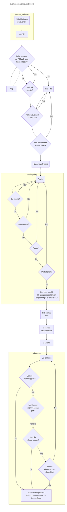

```mermaid
flowchart TD

eventorurl(eventor.orientering.se/Events) -.-> eventor
style eventorurl fill:#fff,stroke:#fff

subgraph "≥ en vecka innan"
  eventor(Hitta tävlingen<br/>på eventor)
  anmäl
  eventor --> anmäl
end

pmstart{kolla eventor:<br/>har PM och start-<br/>tider släppts?} --- Nej -.-> pmstart
anmäl -.-> pmstart
pmstart -- Ja --> pm
pmstart -- Ja --> starttid
pm(Läs PM)
starttid{Koll på<br/>starttid?} -- Nej --> pmstart
starttid --> avstarena
avstarena{Koll på avstånd<br/>P->arena?} -- Nej --> pm
avstarena --> avststart
avststart{Koll på avstånd<br/>arena->start?} -- Nej --> pm
avststart --> avgtid
pm --> avstarena
avgtid(Härled avgångstid) -.-> packa

subgraph "tävlingsdag"

  packa(Packa) --> skor

  skor{OL-skorna?} -- Nej --> packa
  skor -- Ja --> kompass
  kompass{Kompassen?} -- Nej --> packa
  kompass -- Ja --> pinne
  pinne{Pinnen?} -- Nej --> packa
  pinne -- Ja --> def
  def{Defhållaren?} -- Nej --> packa
  def -- Ja --> resa

  resa(Kör eller samåk<br/>till googlemaps-länken<br/>längst ner på eventorsidan)
end

resa --> pskylt
pskylt(Följ skyltar<br/> till P) --> pfolk
pfolk(Följ folk<br/> i reflexvästar) --> parkera
parkera --> tillarenan

subgraph "på arenan"
  tillarenan(Gå omkring) --> seflaggan
  seflaggan{Ser du<br/>klubbflaggan?} -- Nej --> finnsflaggan
  seflaggan -- Ja --> ordnat
  finnsflaggan{Har klubben<br/>glömt flaggan<br/>igen?} -- Kanske --> seledare
  seledare{Ser du<br/>någon ledare?} -- Nej --> sehjort
  seledare -- Ja --> ordnat
  sehjort{Ser du<br/>någon annan<br/>skogshjort} -- Nej --> tillarenan
  sehjort -- Ja --> ordnat
  ordnat[Nu ordnar sig resten.<br/>Om du undrar något så fråga någon]
end

```

